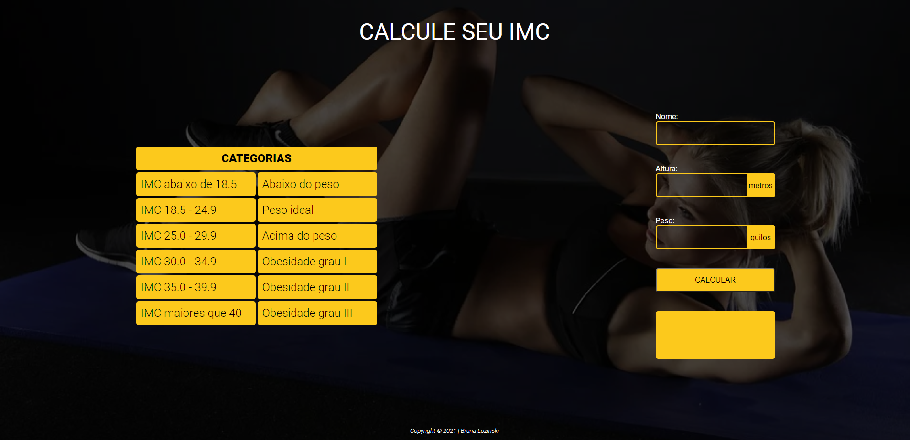

# calculadora-imc-js

<b>Projeto criado com o objetivo didático para as aulas de Programação Web Front-End (PWFE) do curso Desenvolvimento de Sistemas do [SENAI Jandira](https://jandira.sp.senai.br/), sobre orientação da [Bruna Lozinski](https://github.com/brunalozinski)<b>

<b>O projeto consiste em criar uma sistema que tenha a capacidade de calcular o IMC e dizer se você está no peso ideal a sua altura, utilizando vários eventos.<b>

